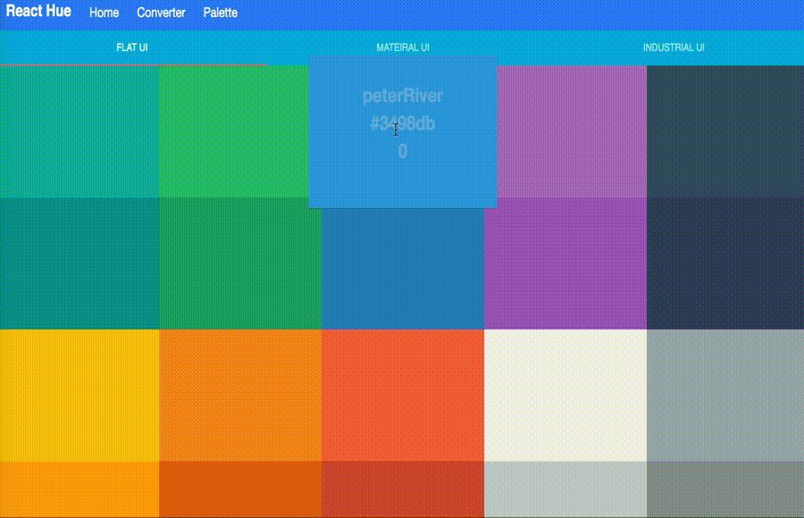

#React Hue
[](https://travis-ci.org/gongbaochicken/React-Hue)

<<<<<<< HEAD
React Hue is a color palette tool built in a combination of Meteor.js, React, Material UI, Bootstrap. This simple web app mainly to contribute to seek what are better colors for web, mobile, UI development, the popular color set used by industry companies, color toolboxes, and some information for color blindness.
=======
React Hue is a color palette tool built in a combination of Meteor.js, React, Material UI, Bootstrap. This simple web app mainly to contribute to seek what are better colors for web, mobile, UI development, the popular color set used by industry companies, and provides with a reactive way to get or convert the color hex code and LESS code. 
>>>>>>> 5864a56b8eb01c83c245fb6cc40b969193f039e6

Demo: http://react-hue.herokuapp.com/



Please forgive this compressed gif at this time, and try to run it locally if you have interest. The demo will be deployed soon.


## :memo: Version: 1.0
## :yum: Features:
 - Pick up popular and suitable colors for design and development.
 - Fast realtime render for color changing to boost reactive UX.
<<<<<<< HEAD
 - Reactive way to converse color HEX value to RGB value.
 - LESS generator
=======
 - Reactive way to converse color hex value to rgb.
 - Reactive LESS generator.
>>>>>>> 5864a56b8eb01c83c245fb6cc40b969193f039e6

## Why use Meteor?
Meteor is a real-time, easy-use full-stack web platform with data synchronization client/server (DDP). It is on the top of Node.js and MongoDB, which means one language can be used in both front-end client and back-end server. It saves a lot of my time and it keeps its promise of optimizing for developer happiness.

## Why use React?
React is fast rendered, and enforces a lot of rules and guidelines that make it clearer what the “right” way to do any given task is. While it’s not as tightly integrated with Meteor (yet), it does have a much larger overall ecosystem.

## Why use Material UI?
As a superstar project host by Goolge, Material UI is more clear, attractive, delightful, when it is compared with other popular UI frameworks. Meanwhile, it leverages good sides of React.js, and improves the rendering effects. After using frameworks like Bootstrap for a long time, it is a good time for us to try new tastes.

## :cloud: Getting Started

Install the latest version of Node and NPM. We recommend the usage of [NVM](http://nvm.sh).

[Install Meteor](https://www.meteor.com/install):

```sh
curl https://install.meteor.com/ | sh
```

Clone this repository locally via SSH:

```sh
git clone https://github.com/gongbaochicken/React-Hue.git
```

(or `git clone git@github.com:gongbaochicken/React-Hue.git` if you have set your SSH key successfully.)

Install the necessary NPM packages:

```sh
cd React-Hue
npm install
```

Then please run the app with:

```sh
meteor
```

You'll then be able to access it on [http://localhost:3000](http://localhost:3000).

### :dizzy: Please star this project if you like it.
